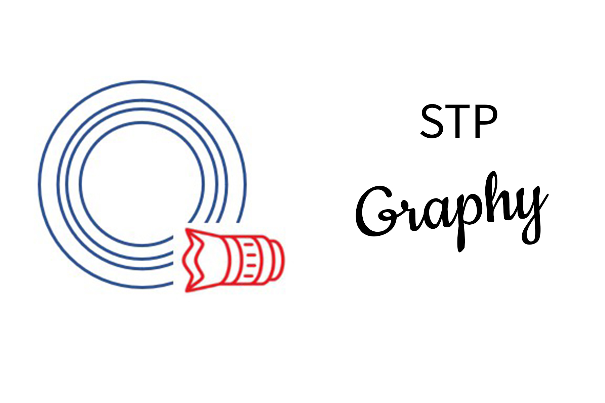

### Please read this readme and follow these instructions before going down to issues and post

STPGraphy (STPGraPHY) or Sait Piboonbumpen photography project. Is a school project that gathers every photographers in school up and try to manipulate these works as teamwork.  This project also invents something new for teachers to collaborate with. And teach other students with our inventions.

Currently there are no "inventions" that can be seen, touch, or feel. Because of budget shortage, bad teammates and COVID 19 outbreak

We have a small group among our teammates who are developing a Discord bot and web-based cloud server to have our clients access our schoolwork photos as easy as possible

### Discord bot

Discord are one of our services to help our clients have the easiest access to schoolworks or projects. And its easy to get it up and running without inviting a mainframe version to the bot

### Installation

Clone all files from this repository and extract it somewhere safe

Download everything thats required in this list to get the bot working. Node js and any coding program (Visual studio code is a must)

Open visual studio code and open file (the file that you've extracted this repoitory)

Head to index.js and add your bot token in `const token = ""`

type `node .` in terminal and that should work without a problem
